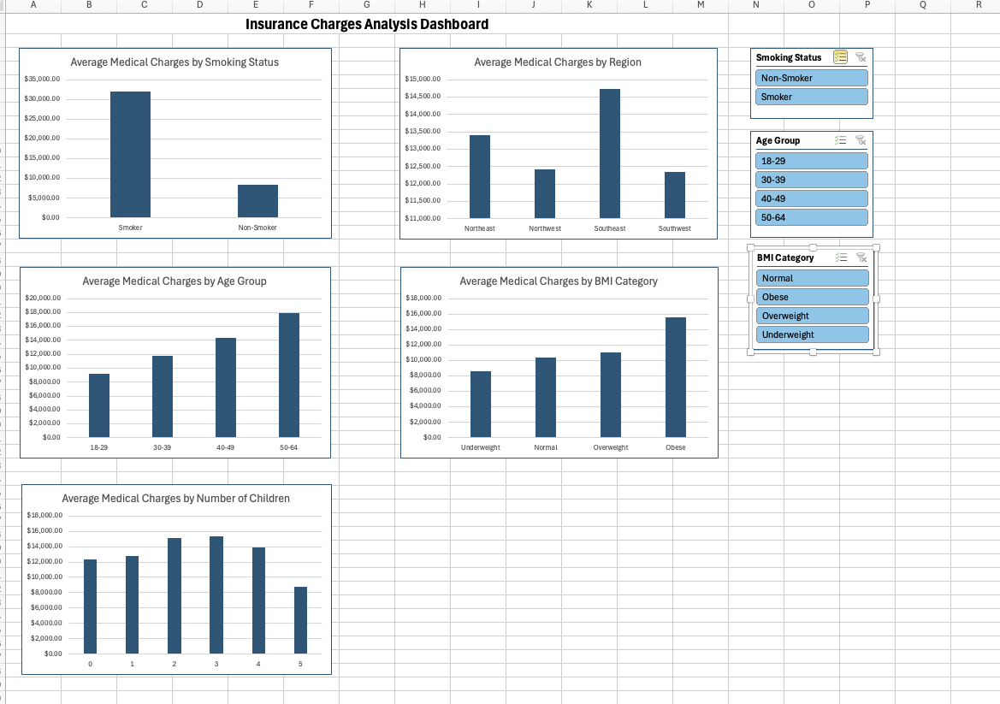

# Insurance Charges Analysis

## Project Overview

This project analyzes an insurance dataset to identify factors that influence medical insurance charges. The analysis was completed using SQL, Python, and Microsoft Excel.

---

## Objectives

- Analyze average insurance charges by demographic characteristics.
- Compare medical costs across different groups.
- Build an interactive dashboard for data exploration.
- Practice data analysis techniques commonly used in actuarial work.

---

## Tools Used

- SQL
- Python (Pandas, Matplotlib)
- Microsoft Excel (PivotTables, PivotCharts, Slicers)

---

## Analysis Performed

### SQL

- Calculated average medical charges.
- Compared charges by smoking status.
- Compared charges by region.
- Compared charges by age group.
- Compared charges by BMI category.
- Compared charges by number of children.
- Identified highest and lowest medical charges.
- Retrieved the top 10 highest charges.
- Applied filtering techniques.

### Python

- Imported and explored the dataset using Pandas.
- Performed grouped analyses.
- Created reusable visualization functions.
- Built bar charts using Matplotlib.

### Excel Dashboard

Created an interactive dashboard using:

- PivotTables
- PivotCharts
- Slicers

Dashboard visualizations include:

- Average Medical Charges by Smoking Status
- Average Medical Charges by Region
- Average Medical Charges by Age Group
- Average Medical Charges by BMI Category
- Average Medical Charges by Number of Children

Interactive slicers allow filtering by:

- Smoking Status
- Age Group
- BMI Category

---

## Key Findings

- Smokers have significantly higher average medical charges than non-smokers.
- Medical charges generally increase with age.
- Obese individuals have higher average medical charges than other BMI categories.
- Regional differences exist but are smaller than differences by smoking status.

---

## Dashboard Preview

*Add a screenshot of the dashboard here.*

---

## Skills Demonstrated

- SQL querying
- Data analysis
- Data visualization
- Microsoft Excel
- PivotTables
- PivotCharts
- Interactive dashboards
- Python programming
- Pandas
- Matplotlib
